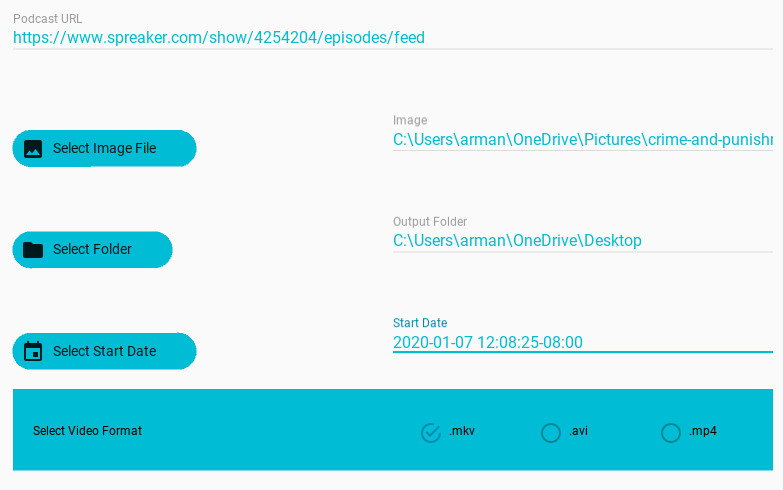

## rss2vid

A GUI app for batch converting podcasts to videos for social media.

### usage

1. Download and unzip [package](https://github.com/armanraina/rss2vid/releases/download/v1.0.1-alpha/rss2vid-1.0.1.zip)

2. Get the RSS link of your podcast 

3. Set conversion options

4. Process batch conversion

### support project

